# AeroStore — E-Commerce DevOps Journey

A comprehensive DevOps project implementing modern infrastructure practices—including Docker, Kubernetes, and automated CI/CD pipelines—for a full-stack e-commerce application. This repository tracks the evolution from local development to a production-ready, cloud-native architecture.

## 🚀 Tech Stack & Infrastructure

| Layer | Technology |
|---|---|
| **Frontend** | React, Vite |
| **Backend** | Node.js, Express |
| **Containers** | Docker, Docker Hub |
| **Orchestration** | Kubernetes (`kind` for local testing) |
| **CI/CD** | GitHub Actions |
| **Networking** | Kubernetes ClusterIP & NodePort Services |

---

## 🏗️ The DevOps Flow (What We've Built So Far)

This project has been built iteratively. If you are a new developer joining the team, here is the journey of how our infrastructure is structured:

### Phase 1: Application Setup ✅
We started with a standard local development environment. 
- A React Frontend and a Node.js/Express Backend communicating via REST.
- *Status: Fully functional locally.*

### Phase 2: Containerization & Registries ✅
We moved away from "it works on my machine" by introducing Docker.
- Created highly optimized `Dockerfiles` for both Frontend and Backend.
- Implemented robust tagging and versioning strategies.
- Pushed our artifacts to Docker Hub for remote distribution.
- *Docs:* [Docker Architecture & Images](docs/Docker-Architecture-Images-Layers-Containers.md), [Container Registry Distribution](docs/Container-Registry-Tagging-And-Distribution.md).

### Phase 3: Kubernetes Orchestration ✅
We transitioned from managing individual Docker containers to orchestrating them declaratively using Kubernetes.
1. **Local Cluster Setup:** We use `kind` (Kubernetes IN Docker) to simulate a production multi-node cluster (1 Control Plane + 1 Worker Node) directly on our local machines.
2. **Workloads:** We manage our applications using **Deployments** (which manage ReplicaSets, which manage Pods). This ensures high availability and enables **Zero-Downtime Rollouts** when updating app versions.
3. **Networking:** We expose our applications using Kubernetes **Services**. A `NodePort` service allows external browser traffic to safely hit our ephemeral Pods without relying on unreliable Pod IP addresses.
- *Docs:* [K8s Architecture](docs/Kubernetes-Cluster-Architecture.md), [Local Cluster Setup](docs/Local-Kubernetes-Cluster-Setup.md), [Pods & ReplicaSets](docs/Kubernetes-Pods-And-ReplicaSets.md), [Deployments & Rollouts](docs/Kubernetes-Deployments-And-Rollouts.md).

### Phase 4: Artifact Flow & CI/CD Pipeline Design ✅ *(NEW)*
We designed the end-to-end artifact delivery pipeline — the system that connects a code change to a running production container, with full traceability and immutability guarantees.

**What this phase covers:**
- How a Git commit or PR merge triggers the CI pipeline automatically via GitHub Actions.
- How the CI pipeline builds Docker images, runs tests, and tags images with Git commit SHAs for traceability.
- How image tags (human-readable labels) and image digests (immutable SHA-256 hashes) work together to version artifacts.
- How images are pushed to Docker Hub as the central distribution point.
- How Kubernetes pulls the specified image and performs a rolling update with zero downtime.

**Key principle:** *Build once, deploy everywhere.* The exact same Docker image that passes CI tests is what runs in production — no rebuilding, no environment drift, no surprises.

- *Docs:* [Artifact Flow: Source → Cluster](docs/Artifact-Flow-Source-To-Cluster.md), [CI/CD Pipeline Plan](docs/CICD-Pipeline-Plan.md).

#### 📊 End-to-End Artifact Flow Diagram

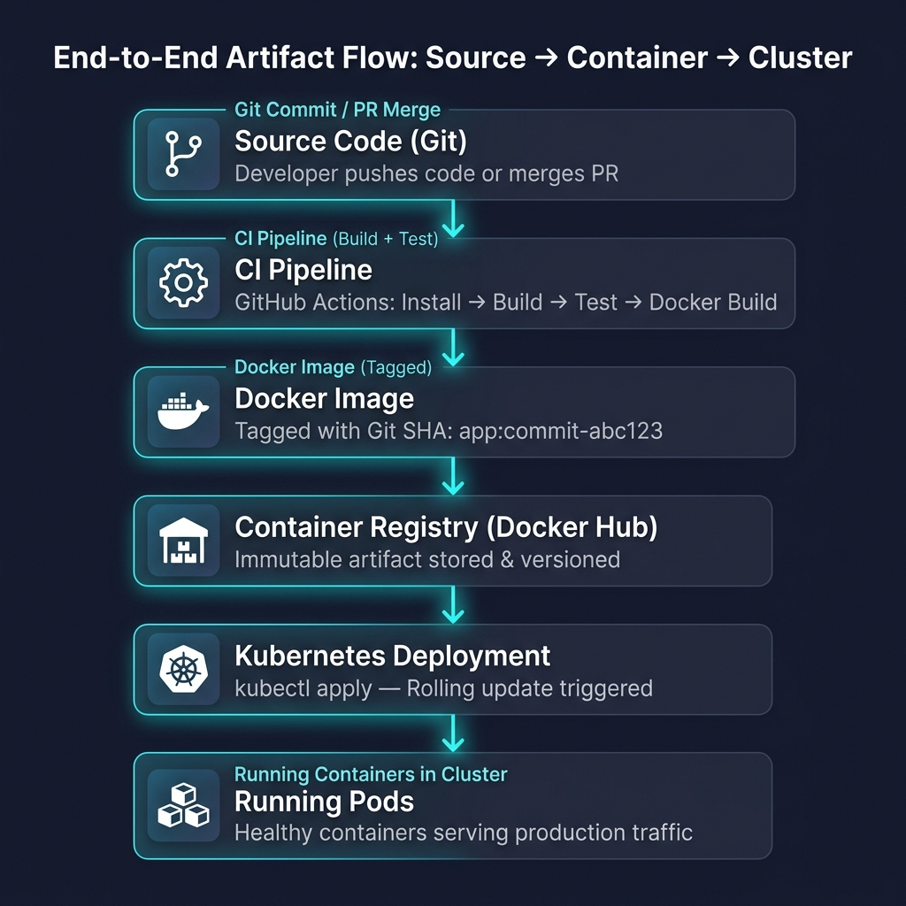

```
Git Commit / PR Merge
        ↓
CI Pipeline (Build + Test)
        ↓
Docker Image (Tagged with Git SHA)
        ↓
Container Registry (Docker Hub)
        ↓
Kubernetes Deployment (Rolling Update)
        ↓
Running Containers in Cluster
```

#### 💡 Reflection: Why Immutable Artifacts Matter

Deploying immutable Docker images instead of raw source code is fundamentally safer because it eliminates an entire class of deployment failures rooted in environmental inconsistency.

- **Reliability:** The image that passed CI is the exact same binary that runs in production — no build-step variance.
- **Rollbacks:** Rolling back is instantaneous — point Kubernetes to the previous image tag. No rebuilding needed.
- **Traceability:** Every image is tied to a Git commit SHA. From a running pod, you can trace back to the exact line of code that produced it.
- **Consistency:** The same image runs identically across dev, staging, and production — eliminating "works on my machine" problems.

> For the full reflection and a detailed production bug case study, see [Artifact Flow Documentation](docs/Artifact-Flow-Source-To-Cluster.md#8-reflection--why-immutable-artifacts-are-safer).

### Phase 5: Kubernetes Workload Lifecycle ✅ *(NEW)*
We documented the complete internal lifecycle of how Kubernetes manages application workloads — from a Deployment definition to running, self-healing Pods.

**What this phase covers:**
- How a **Deployment** defines desired state, creates a **ReplicaSet**, which in turn creates and manages **Pods**.
- How the **kube-scheduler** assigns Pods to Nodes based on resource availability.
- How Kubernetes **continuously reconciles** desired state vs. current state — automatically restarting crashed Pods and rescheduling on node failure.
- How **rolling updates** work: new Pods are created with the new image while old Pods are gradually terminated, maintaining availability throughout.
- How **health probes** (Liveness, Readiness, Startup) influence Pod lifecycle and protect traffic from reaching unhealthy containers.
- How **CPU/memory requests and limits** affect scheduling decisions and runtime behavior.
- Common **Pod failure states**: `Pending`, `CrashLoopBackOff`, `ImagePullBackOff`, `OOMKilled` — causes, meaning, and automatic Kubernetes responses.

**Key principle:** *Kubernetes manages desired state, not application correctness.* The platform guarantees that the right number of containers are always running — but it's the application's responsibility to be correct. This boundary is what makes self-healing automation possible at scale.

- *Docs:* [K8s Workload Lifecycle](docs/Kubernetes-Workload-Lifecycle.md).

#### 📊 Kubernetes Lifecycle Diagram

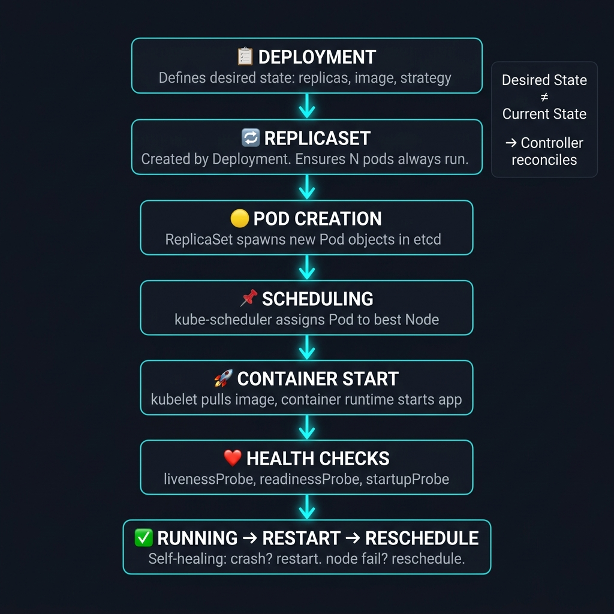

```
Deployment (desired state)
       ↓
  ReplicaSet
       ↓
  Pod Creation
       ↓
   Scheduling
       ↓
 Container Start
       ↓
 Health Checks
       ↓
Running / Restart / Reschedule
```

#### 💡 Reflection: Desired State vs. Application Correctness

Kubernetes focuses on maintaining desired state rather than guaranteeing application correctness because the platform's responsibility is infrastructure automation — not business logic. Self-healing behavior (restarting crashed pods, rescheduling on node failure) is only possible because it is declarative and stateless from the platform's perspective. If Kubernetes tried to validate whether your application was *correct*, it would need to understand your domain — an impossible and unscalable boundary. Instead, it trusts health probes (defined by the developer) as the signal for correctness, and automates all recovery actions from there. This clean separation between platform responsibility and application responsibility is what makes Kubernetes reliable at scale.

> For full details including rolling update mechanics, probe configurations, and the failure case study, see [Kubernetes Workload Lifecycle](docs/Kubernetes-Workload-Lifecycle.md).

### Phase 6: CI/CD Execution Model & Responsibility Boundaries ✅ *(NEW)*
We documented the complete CI/CD execution model — explaining where each pipeline action happens, who owns it, and why clean responsibility boundaries are essential for safe and predictable production systems.

**What this phase covers:**
- What **CI** is responsible for (validate + package) vs. what **CD** is responsible for (deploy + deliver), and what each layer must never do.
- A complete **responsibility map** showing where every action — writing code, running tests, building images, deploying, self-healing — actually occurs.
- Why mixing application logic, pipeline logic, and deployment logic creates fragile systems with large blast radii, unsafe PRs, and unreliable rollbacks.
- How modifying CI test steps, build steps, or CD deployment steps produces different downstream effects, and how to reason about these before merging.
- The principle that **CI/CD pipelines orchestrate work** — they do not replace application logic or infrastructure behavior.

**Key principle:** *Pipelines are automation glue — they coordinate handoffs between layers, but they must never absorb the logic that belongs to those layers.* Clean separation means every failure has a single, identifiable owner.

- *Docs:* [CI/CD Execution Model & Responsibilities](docs/CICD-Execution-Model-And-Responsibilities.md).

#### 📊 CI/CD Execution Model Diagram

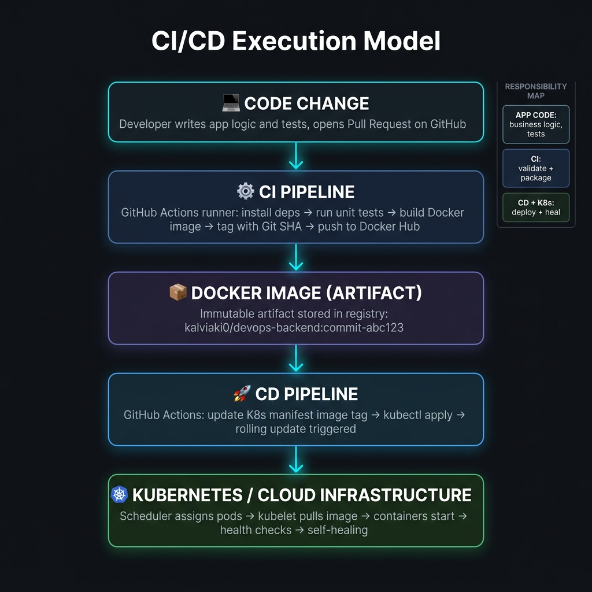

```
Code Change (Developer)
        ↓
CI Pipeline (Tests + Build + Push)
        ↓
Docker Image (Artifact in Registry)
        ↓
CD Pipeline (Deploy)
        ↓
Kubernetes / Cloud Infrastructure (Run + Heal)
```

#### 💡 Reflection: Why Pipelines Must Orchestrate, Not Replace

CI/CD pipelines are coordination tools — they automate the sequencing and triggering of well-defined operations across layers. When a pipeline starts containing business rules or infrastructure provisioning scripts, it collapses the boundaries that make a system safe. Clear ownership means: a test failure belongs to the application layer, a deployment failure belongs to the CD layer, and a container restart belongs to Kubernetes. When those responsibilities blur, debugging becomes archaeology.

> For full details including the blast radius analysis, pipeline change impact assessment, and the responsibility boundary case study, see [CI/CD Execution Model Documentation](docs/CICD-Execution-Model-And-Responsibilities.md).

### Phase 7: Kubernetes Service Discovery & Internal Networking ✅ *(NEW)*
We implemented and documented DNS-based service discovery inside the Kubernetes cluster — demonstrating how application components communicate with each other using stable Service names instead of ephemeral Pod IP addresses.

**What this phase covers:**
- Why **Pod IPs are ephemeral** and hardcoding them causes unreliable communication.
- How a **Kubernetes Service** provides a stable ClusterIP and a DNS name that survives Pod restarts, rescheduling, and rolling updates.
- How **CoreDNS** (the cluster's built-in DNS resolver) automatically resolves Service names to ClusterIPs.
- How `kube-proxy` load-balances traffic across all healthy Pods behind a Service using label selectors.
- A **working verification** of DNS resolution and Pod-to-Service communication from inside a debug Pod.

**Key principle:** *Service names are the stable endpoints inside a Kubernetes cluster — not Pod IPs.* Any component that needs to communicate with another should use `http://<service-name>:<port>`. Kubernetes handles all routing, load balancing, and failover automatically.

- *Docs:* [Kubernetes Service Discovery & Networking](docs/Kubernetes-Service-Discovery-And-Networking.md).
- *Manifests:* [`k8s/basics/backend-service.yaml`](k8s/basics/backend-service.yaml), [`k8s/basics/curl-client-pod.yaml`](k8s/basics/curl-client-pod.yaml).

#### 📊 Service Discovery Diagram

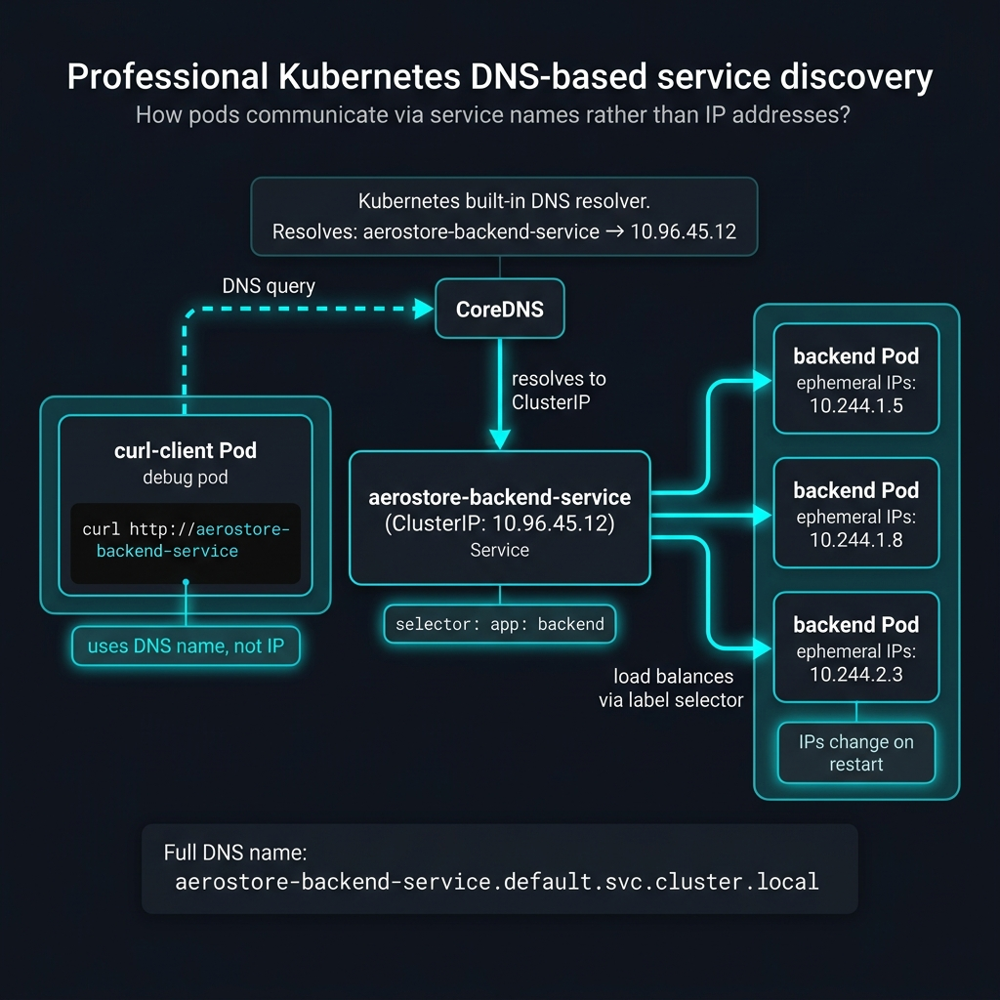

```
curl-client Pod
      ↓  curl http://aerostore-backend-service:3001
   CoreDNS
      ↓  resolves to stable ClusterIP
aerostore-backend-service (ClusterIP)
      ↓  load balances via label selector
backend Pod 1 | backend Pod 2 | backend Pod 3
(IPs change on restart — Service name stays stable)
```

#### 💡 Why Service Discovery Matters

Without Services, any Pod restart would break inter-component communication because Pod IPs change. With Services and DNS, the name `aerostore-backend-service` always resolves to the correct running Pods — regardless of how many times they've been replaced, rescheduled, or scaled.

> For the full DNS resolution flow, verification commands, and scalability analysis, see [Kubernetes Service Discovery & Networking](docs/Kubernetes-Service-Discovery-And-Networking.md).

### Phase 8: ConfigMaps & Secrets — Secure Configuration Management ✅ *(NEW)*
We externalized all application configuration and sensitive credentials from source code into Kubernetes-native objects — ConfigMaps and Secrets — and demonstrated how they are injected into running Pods at startup.

**What this phase covers:**
- Why hardcoding configuration and credentials in source code or Dockerfiles is a security and maintainability failure.
- How **ConfigMaps** store non-sensitive key-value configuration (`APP_ENV`, `LOG_LEVEL`, `APP_PORT`, service URLs) outside the application code.
- How **Secrets** store sensitive credentials (`DB_PASSWORD`, `DB_USER`, `DB_HOST`) with base64 encoding and RBAC-restricted access.
- How Kubernetes injects both into Pods as environment variables using `envFrom` (bulk) and `valueFrom` (selective) — with no code changes required.
- How the **same Docker image** can be deployed to dev, staging, and production with different configurations by simply applying different ConfigMaps and Secrets.

**Key principle:** *The application image is environment-agnostic. Configuration is the variable — not the code.* This is the foundation of scalable, secure, multi-environment deployments.

- *Docs:* [Kubernetes ConfigMaps & Secrets](docs/Kubernetes-ConfigMaps-And-Secrets.md).
- *Manifests:* [`k8s/basics/app-configmap.yaml`](k8s/basics/app-configmap.yaml), [`k8s/basics/app-secret.yaml`](k8s/basics/app-secret.yaml), [`k8s/basics/backend-deployment.yaml`](k8s/basics/backend-deployment.yaml).

#### 📊 Configuration Injection Diagram

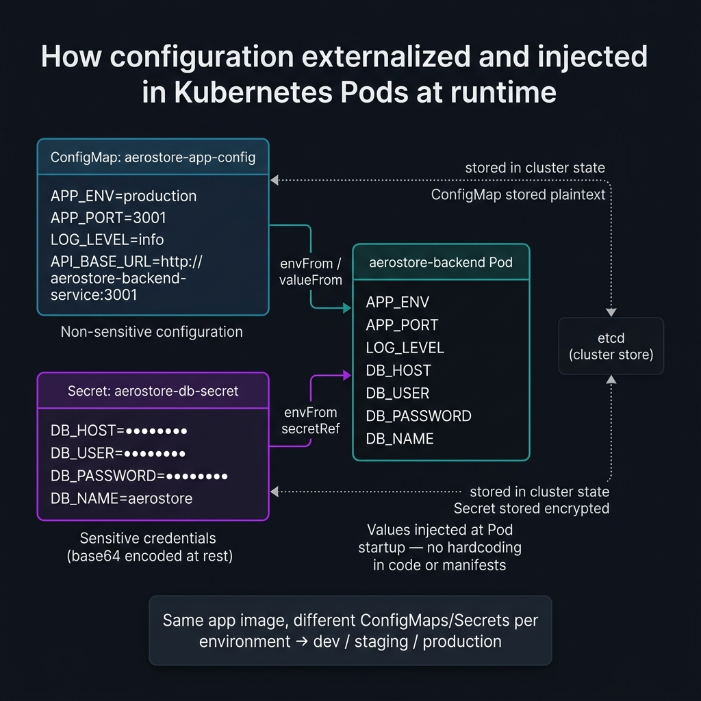

```
ConfigMap: aerostore-app-config     Secret: aerostore-db-secret
  APP_ENV=production                  DB_HOST=      ••••••••
  APP_PORT=3001                       DB_USER=      ••••••••
  LOG_LEVEL=info                      DB_PASSWORD=  ••••••••
        ↓ envFrom configMapRef             ↓ envFrom secretRef
            └────────────────────────┘
                    aerostore-backend Pod
              process.env.APP_ENV, DB_PASSWORD...
              (no hardcoded values, same image for all envs)
```

#### 💡 Reflection: Configuration vs Code

Externalizing configuration separates *what the app does* from *where and how it runs*. A developer can change a database connection string or flip a feature flag with a single `kubectl apply` — no rebuild, no new Docker tag, no deployment pipeline required. And because Secrets are managed by the platform with RBAC, developers write code without ever seeing production credentials.

> For the full injection patterns, verification steps, security analysis, and multi-environment strategy, see [Kubernetes ConfigMaps & Secrets](docs/Kubernetes-ConfigMaps-And-Secrets.md).

### Phase 9: Health Probes — Liveness, Readiness & Startup ✅ *(NEW)*
We implemented all three Kubernetes health probes in the backend Deployment and a dedicated demo Pod, making the application self-healing and traffic-safe during failure conditions and slow restarts.

**What this phase covers:**
- How the **Startup Probe** blocks liveness and readiness checks until slow initialization completes, preventing premature restarts.
- How the **Liveness Probe** detects irrecoverable bad states (deadlocks, frozen handlers) and triggers an automatic container restart.
- How the **Readiness Probe** removes an unhealthy or not-yet-ready Pod from the Service endpoint list — protecting users without restarting the container.
- The critical behavioral difference: liveness failure = **restart**, readiness failure = **stop traffic**.
- How both probes together handle the real-world scenario of an app entering a bad state and then taking time to re-initialize after restart.

**Key principle:** *Kubernetes only knows a container process is running — not whether the application inside it is healthy. Health probes bridge that gap, making self-healing possible at the application level.*

- *Docs:* [Kubernetes Health Probes](docs/Kubernetes-Health-Probes.md).
- *Manifests:* [`k8s/basics/backend-deployment.yaml`](k8s/basics/backend-deployment.yaml) (updated with probes), [`k8s/basics/probe-demo-pod.yaml`](k8s/basics/probe-demo-pod.yaml) (demo).

#### 📊 Health Probes Diagram

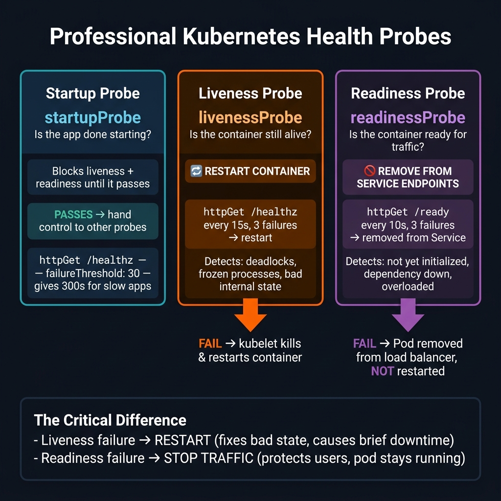

```
startupProbe → PASSES → livenessProbe + readinessProbe both activate
                              ↓                        ↓
                         FAIL →                   FAIL →
                      RESTART container       REMOVE FROM SERVICE
                      (fixes bad state)       (protects users,
                                               no restart)
```

#### 💡 Why Both Probes Together

Liveness alone restarts the container but sends traffic during the recovery window. Readiness alone stops traffic but never fixes the deadlock. Together: liveness restarts the broken container, readiness protects users while it re-initializes, and traffic resumes automatically when the app is actually ready.

> For probe configuration details, failure demonstrations, and the full scenario walkthrough, see [Kubernetes Health Probes](docs/Kubernetes-Health-Probes.md).

### Phase 10: Resource Management — CPU & Memory Requests and Limits ✅ *(NEW)*
We defined CPU and memory requests and limits across all workloads and implemented namespace-level resource governance using LimitRange and ResourceQuota, preventing the noisy neighbor problem in a shared cluster.

**What this phase covers:**
- How **requests** (the scheduling guarantee) differ from **limits** (the runtime enforcement ceiling).
- Why CPU and memory behave differently when limits are exceeded: CPU is **throttled** (slows down, no crash), memory causes an **OOMKill** (process killed immediately, exit code 137).
- How the **kube-scheduler** uses resource requests to find a Node with sufficient unallocated capacity — and what happens when no Node qualifies (`Pending`).
- How **LimitRange** applies default resource constraints to any container that omits them, eliminating the "forgot to set resources" failure mode.
- How **ResourceQuota** caps the total CPU and memory budget for the entire namespace, preventing one team from consuming all cluster resources.
- The **noisy neighbor problem**: how missing limits in a shared cluster causes one app to crash others, and how proper configuration prevents it.

**Key principle:** *Without requests, the scheduler is blind. Without limits, the kernel has no boundaries to enforce. Both are required for a stable, fair, production-grade cluster.*

- *Docs:* [Kubernetes Resource Management](docs/Kubernetes-Resource-Management.md).
- *Manifests:* [`k8s/basics/resource-demo-pod.yaml`](k8s/basics/resource-demo-pod.yaml), [`k8s/basics/namespace-resource-policy.yaml`](k8s/basics/namespace-resource-policy.yaml).

#### 📊 Resource Management Diagram

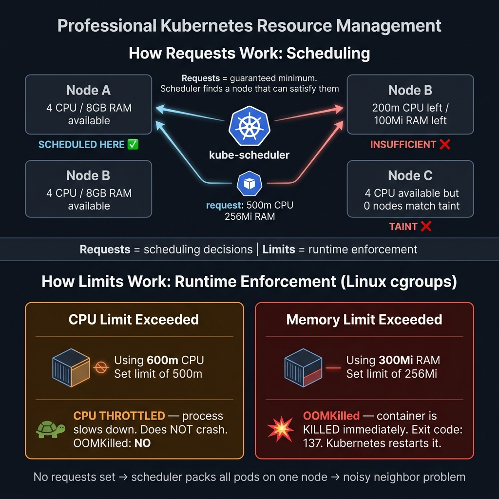

```
Requests → Scheduler uses to pick a Node with enough capacity
         → Pod stays Pending if no Node qualifies

Limits → CPU: throttled (slows down, no crash)
       → Memory: OOMKilled (killed instantly, exit code 137)

No limits = unbounded container = noisy neighbor = other Pods crash
```

#### 💡 Reflection: Resource-Aware Kubernetes Design

Resource configuration is not optional in a shared cluster — it is the contract between your application and the platform. Requests tell the platform what your app needs. Limits tell the platform how much it can take. Without this contract, the cluster cannot make fair scheduling decisions, and any single workload can degrade or destroy the reliability of every other workload running alongside it.

> For the full CPU vs memory enforcement analysis, LimitRange and ResourceQuota details, and the noisy neighbor scenario walkthrough, see [Kubernetes Resource Management](docs/Kubernetes-Resource-Management.md).

### Phase 11: Scaling — Manual Scaling & Horizontal Pod Autoscaler ✅ *(NEW)*
We implemented both manual scaling and automatic metric-driven scaling via HPA, demonstrating how Kubernetes elastically adjusts the number of running Pods in response to changing traffic load.

**What this phase covers:**
- How **manual scaling** (`kubectl scale --replicas=N`) directly and immediately adjusts the Deployment replica count — and when this is the right tool.
- How the **Horizontal Pod Autoscaler (HPA)** continuously watches CPU metrics via the Metrics Server and automatically adjusts replica count to keep average CPU at the target.
- The **HPA decision formula:** `desiredReplicas = ceil(currentReplicas × currentCPU / targetCPU)` — a concrete, predictable calculation.
- How **stabilization windows** prevent thrashing: fast scale-up (30s) vs. slow scale-down (5 min).
- How **minReplicas** and **maxReplicas** protect the application (always available) and the cluster (cannot exhaust resources).
- Why targeting 50% CPU (not 80%+) leaves headroom for traffic spikes while new Pods are being scheduled.

**Key principle:** *Manual scaling is deliberate and immediate. HPA is automatic and continuous. Production systems need both: HPA for normal traffic variability, manual scaling for planned events and incident override.*

- *Docs:* [Kubernetes Scaling & HPA](docs/Kubernetes-Scaling-And-HPA.md).
- *Manifests:* [`k8s/basics/backend-hpa.yaml`](k8s/basics/backend-hpa.yaml), [`k8s/basics/scaling-demo.md`](k8s/basics/scaling-demo.md).

#### 📊 Scaling & HPA Diagram

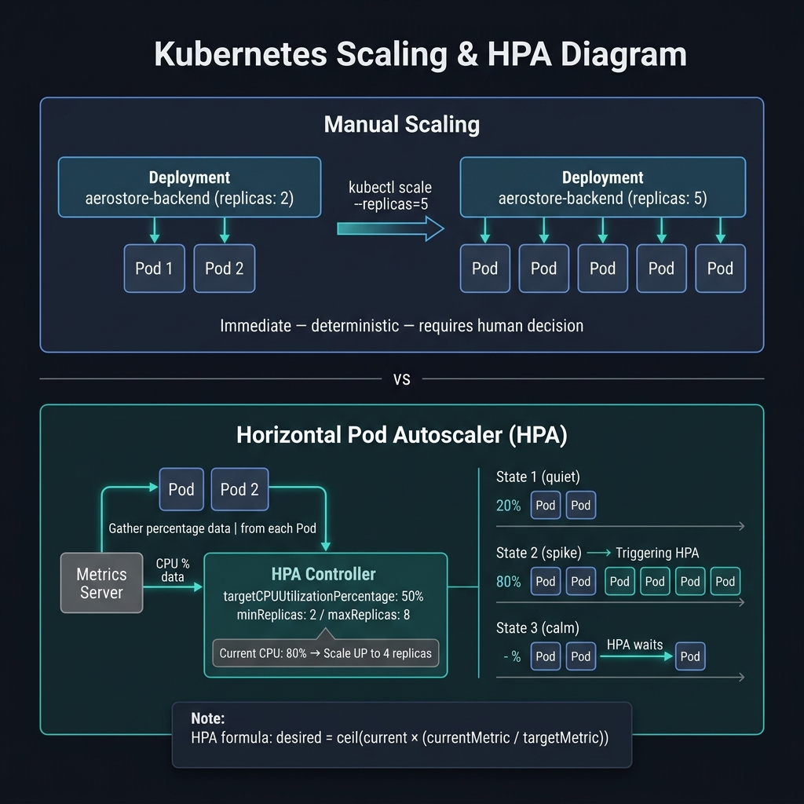

```
Manual:  kubectl scale --replicas=5 → immediate, human-driven

HPA:     CPU 80% / target 50%
         → desiredReplicas = ceil(2 × 80/50) = 4
         → Deployment updated automatically
         → 2 new Pods scheduled and ready (~60s)
         → CPU returns to ~50% per Pod
         Traffic drops → wait 5min → scale back to minReplicas=2
```

#### 💡 Reflection: Autoscaling as a First-Class Reliability Tool

HPA is not just a cost-saving feature — it is a reliability mechanism. Without it, traffic spikes that exceed current capacity result in slow or failed requests. With HPA and a well-chosen CPU target, the cluster self-adjusts within the time it takes for a new Pod to become ready, keeping response times stable without any human intervention.

> For the full HPA formula walkthrough, scenario analysis, and manual vs HPA comparison, see [Kubernetes Scaling & HPA](docs/Kubernetes-Scaling-And-HPA.md).

### Phase 12: Rolling Updates & Rollbacks — Safe Release and Recovery ✅ *(NEW)*
We configured an explicit RollingUpdate strategy on the backend Deployment and demonstrated how Kubernetes delivers new application versions without downtime, and how it restores the previous stable version instantly when a release fails.

**What this phase covers:**
- How the **RollingUpdate strategy** replaces old Pods with new ones gradually, keeping traffic alive throughout the transition.
- How **`maxSurge: 1`** allows one extra Pod during the rollout, and how **`maxUnavailable: 0`** ensures zero downtime by never terminating an old Pod until a new one is Ready.
- How the **readiness probe acts as the safety gate** — Kubernetes will not advance the rollout (or remove old Pods) until a new Pod passes its readiness check.
- How **`revisionHistoryLimit: 5`** causes Kubernetes to retain 5 previous ReplicaSets as rollback targets, each being a complete snapshot of the previous Pod template.
- How **`kubernetes.io/change-cause`** annotations attach human-readable release notes to each revision in rollout history.
- How **`kubectl rollout undo`** triggers an instant rollback — the old ReplicaSet is already stored, so recovery is a scaling operation (seconds), not a rebuild.

**Key principle:** *Rolling updates limit the blast radius of a bad release. The readiness probe prevents broken Pods from ever entering the Service. Revision history makes recovery instant. Together, these make production deployments safe.*

- *Docs:* [Kubernetes Rolling Updates & Rollbacks](docs/Kubernetes-Rolling-Updates-And-Rollbacks.md).
- *Changes:* [`k8s/basics/backend-deployment.yaml`](k8s/basics/backend-deployment.yaml) — updated with rolling update strategy, revisionHistoryLimit, change-cause annotation, image bump to `nginx:1.17.0`.
- *Demo:* [`k8s/basics/rollout-demo.md`](k8s/basics/rollout-demo.md) — full command sequence for video walkthrough.

#### 📊 Rolling Update Diagram

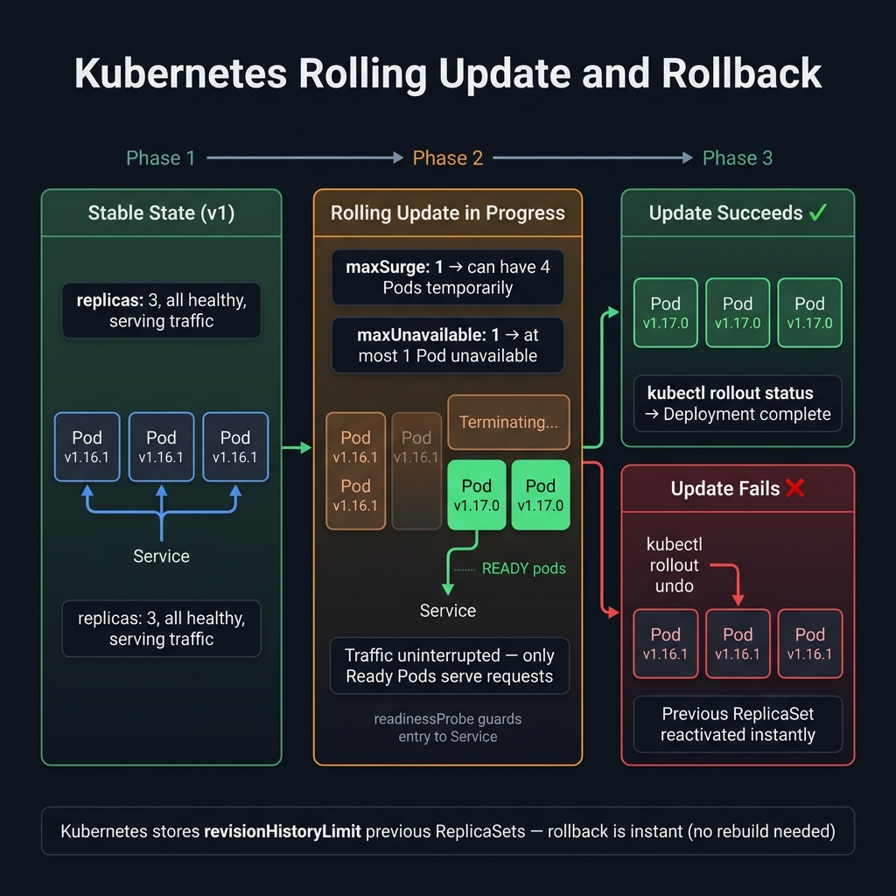

```
Stable (v1):  [Pod 1.16.1] [Pod 1.16.1] [Pod 1.16.1] ← all serving traffic

Rolling:      [Pod 1.16.1] [Pod 1.16.1] [Terminating] [Pod 1.17.0 Ready ✓]
               ↑ still serving           ↑                ↑ now in Service
              maxUnavailable=0: old pod only removed after new pod is Ready

Success:      [Pod 1.17.0] [Pod 1.17.0] [Pod 1.17.0]  ← rollout complete
Failure:      kubectl rollout undo → old ReplicaSet reactivated → stable in ~60s
```

#### 💡 Reflection: Releases as Rolling Operations

In a production environment, every deployment is a risk. The rolling update strategy is Kubernetes' answer to that risk: it limits how many Pods are in an unknown state at any time, it gates each new Pod on its readiness probe before proceeding, and it keeps the previous version intact as an instant rollback target. A deployment that would previously require a maintenance window becomes a live, zero-downtime operation.

> For the full maxSurge/maxUnavailable mechanics, revision history design, bad release scenario, and RollingUpdate vs Recreate comparison, see [Kubernetes Rolling Updates & Rollbacks](docs/Kubernetes-Rolling-Updates-And-Rollbacks.md).

### Phase 13: Helm — Kubernetes Package Management ✅ *(NEW)*
We created a complete Helm chart for the AeroStore application that packages the Deployment, Service, HPA, and ConfigMap into a single versioned release, with environment-specific configuration managed through separate values files — eliminating the need to manually apply and maintain multiple YAML files per environment.

**What this phase covers:**
- How a **Helm chart** packages all Kubernetes manifests into a single versioned, installable unit.
- How **`values.yaml`** defines the default configuration for the chart, and how **`values-dev.yaml`** and **`values-prod.yaml`** provide environment-specific overrides — only listing differences, not duplicating the full file.
- How **Helm templates** use `{{ .Values.X }}` to render environment-specific YAML at install time — the same `deployment.yaml` template produces a 1-replica dev deployment or a 5-replica prod deployment depending on which values file is used.
- How **conditional rendering** (`{{- if .Values.autoscaling.enabled }}`) creates or skips resources per environment — HPA exists in prod, not in dev.
- How **`helm install`**, **`helm upgrade`**, and **`helm rollback`** manage the full application lifecycle with a single command and full revision history (`helm history`).
- How `helm template` and `helm lint` let you preview and validate rendered YAML before applying anything to the cluster.

**Key principle:** *Helm replaces N files × M environments = N×M YAML files with 1 chart + M small override files. Every environment is reproducible, auditable, and upgradeable with a single command.*

- *Docs:* [Kubernetes Helm Package Management](docs/Kubernetes-Helm-Package-Management.md).
- *Chart:* [`helm/aerostore/`](helm/aerostore/) — Chart.yaml, values.yaml, values-dev.yaml, values-prod.yaml, templates/.
- *Demo:* [`helm/aerostore/helm-demo.md`](helm/aerostore/helm-demo.md) — complete install/upgrade/rollback command sequence.

#### 📊 Helm Package Management Diagram

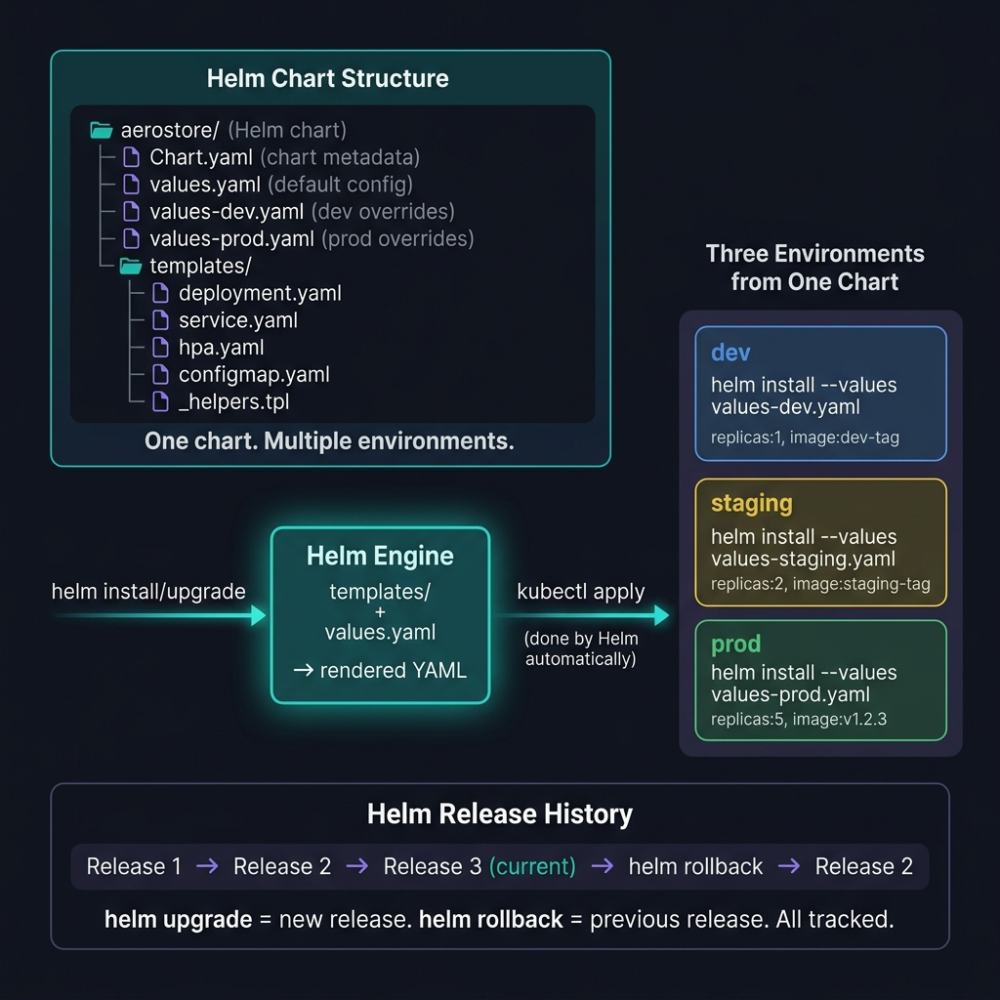

```
values.yaml (defaults)
  + values-dev.yaml         → helm install aerostore-dev  → 1 replica, no HPA
  + values-prod.yaml        → helm install aerostore-prod → 5 replicas, HPA on

templates/ + values → Helm Engine → rendered YAML → cluster

helm upgrade --set image.tag=1.18.0  → new revision  → rolling update
helm rollback aerostore-prod 1       → prev revision → instant recovery
helm history aerostore-prod          → full audit trail
```

#### 💡 Reflection: From Files to Releases

Managing raw YAML files is managing files. Helm shifts the model to managing **releases** — named, versioned, auditable installations of a packaged application. This is the difference between knowing which files were applied (error-prone) and knowing which revision of which chart is running (deterministic). In a CI/CD pipeline, a single `helm upgrade` command replaces a complex sequence of `kubectl apply` commands, version tracking, and environment-specific configuration scripts.

> For the full chart structure walkthrough, values merging explanation, Helm vs kubectl comparison, and scenario analysis, see [Kubernetes Helm Package Management](docs/Kubernetes-Helm-Package-Management.md).

### Phase 14: Custom Helm Chart — Reusable & Environment-Aware Packaging ✅ *(NEW)*
We extended the AeroStore Helm chart with full three-environment support (dev/staging/prod), a `NOTES.txt` post-install guide, and a `values.schema.json` that validates configuration before it reaches the cluster — completing the chart as a production-grade, reusable package.

**What this phase adds:**
- **`values-staging.yaml`** — completes the three-tier environment setup: dev (1 replica, no HPA), staging (2 replicas, HPA on, validates prod config), prod (5 replicas, wide HPA range). Each file only contains differences from `values.yaml` defaults.
- **`templates/NOTES.txt`** — a Helm standard that prints environment-aware next steps after every `helm install` or `helm upgrade`, using `{{- if .Values.autoscaling.enabled }}` conditionals to show HPA status.
- **`values.schema.json`** — a JSON Schema that Helm checks automatically before rendering any templates. Misconfigured values (wrong types, invalid enum values, out-of-range replica counts) are rejected immediately with a clear error, before any resources reach the cluster.
- **`Chart.yaml` v0.2.0** — version bump reflecting the new additions, plus `maintainers` and `keywords` fields.

**Key principle:** *A custom Helm chart is not just a collection of YAML templates — it is a validated, documented, environment-aware package. `values.schema.json` prevents bad configuration. `NOTES.txt` guides operators after every install. Environment-specific values files eliminate per-environment YAML duplication entirely.*

- *Chart:* [`helm/aerostore/`](helm/aerostore/) — now v0.2.0 with staging support and schema validation.
- *Demo:* [`helm/aerostore/helm-demo.md`](helm/aerostore/helm-demo.md).

#### 💡 How Values Drive Everything — Three Environments, One Chart

```
values.yaml (defaults: replicas=3, HPA on, logLevel=info)
    │
    ├── values-dev.yaml     overrides: replicas=1, HPA off, logLevel=debug
    ├── values-staging.yaml overrides: replicas=2, HPA on (max=5), logLevel=info
    └── values-prod.yaml    overrides: replicas=5, HPA on (max=12), logLevel=warn

helm install aerostore-dev  ... --values values-dev.yaml     → 1 replica, no HPA
helm install aerostore-staging ... --values values-staging.yaml → 2 replicas, HPA
helm install aerostore-prod ... --values values-prod.yaml    → 5 replicas, HPA

Same 5 template files. Three distinct cluster states.
```

### Phase 15: Environment-Specific Helm Values — One Chart, Three Environments ✅ *(NEW)*
We documented and formalized the environment-specific Helm values strategy for the AeroStore chart, adding a complete environment comparison runbook, `.helmignore` for proper chart packaging, and dedicated documentation covering the configuration merge model, externalization rules, and the cost of chart duplication.

**What this phase adds:**
- **`environments.md`** — authoritative runbook with a full configuration comparison table across dev/staging/prod, the rationale behind every difference, and exact deploy commands per environment.
- **`.helmignore`** — standard Helm chart file preventing documentation and editor artifacts from being bundled into the chart package when distributed via a chart repository.
- **`docs/Helm-Environment-Configuration.md`** — deep explanation of the configuration drift problem, the Helm merge model with annotated examples, what to externalize into values, and the N×M complexity argument against duplicating charts.

**Key principle for this assignment:** *The same chart, the same templates, the same schema — only the values file changes per environment. `values-dev.yaml` is 8 lines (only what differs). `values-prod.yaml` is 14 lines (only what differs). Every configuration difference is explicit, version-controlled, and reviewable in one small file.*

**Environment configuration comparison:**

| | Development | Staging | Production |
|---|---|---|---|
| Replicas | 1 | 2 | 5 |
| HPA | disabled | enabled (max 5) | enabled (max 12) |
| CPU request | 50m | 100m | 200m |
| Log level | debug | info | warn |
| Image tag | 1.16.1 (stable) | 1.17.0 (RC) | 1.17.0 (pinned) |

- *Docs:* [Helm Environment Configuration](docs/Helm-Environment-Configuration.md).
- *Runbook:* [`helm/aerostore/environments.md`](helm/aerostore/environments.md).

### Phase 16: Persistent Storage — Volumes & PersistentVolumeClaims ✅ *(NEW)*
We implemented PersistentVolumeClaim-based storage for the AeroStore backend, demonstrating how Kubernetes separates storage from the Pod lifecycle to ensure data survives Pod restarts, crashes, and rescheduling.

**What this phase covers:**
- Why container filesystems are **ephemeral by default** — any data written inside a container is destroyed when the Pod is deleted.
- How a **PersistentVolumeClaim (PVC)** requests a slice of durable storage from the cluster that exists independently of any Pod.
- How the **Pod volume mount** (`volumeMounts` + `volumes.persistentVolumeClaim`) connects the running container to the persistent disk at a specific path.
- How **access modes** (ReadWriteOnce, ReadWriteMany) control how many Nodes can mount the volume simultaneously.
- How **StorageClasses** enable dynamic PV provisioning so developers never need to manage raw disks.
- The **PVC lifecycle**: Pending → Bound → survives Pod deletion → Released on PVC deletion (with configurable reclaim policy).

**Key principle:** *A PVC is the boundary between ephemeral compute (Pods) and durable data (PVs). Deleting a Pod does not delete a PVC. This is what makes running stateful applications — databases, file servers, message queues — safe on Kubernetes.*

- *Docs:* [Kubernetes Persistent Storage](docs/Kubernetes-Persistent-Storage.md).
- *Manifests:* [`k8s/basics/backend-pvc.yaml`](k8s/basics/backend-pvc.yaml), [`k8s/basics/stateful-demo-pod.yaml`](k8s/basics/stateful-demo-pod.yaml).
- *Demo:* [`k8s/basics/persistence-demo.md`](k8s/basics/persistence-demo.md).

#### 📊 Persistent Storage Diagram

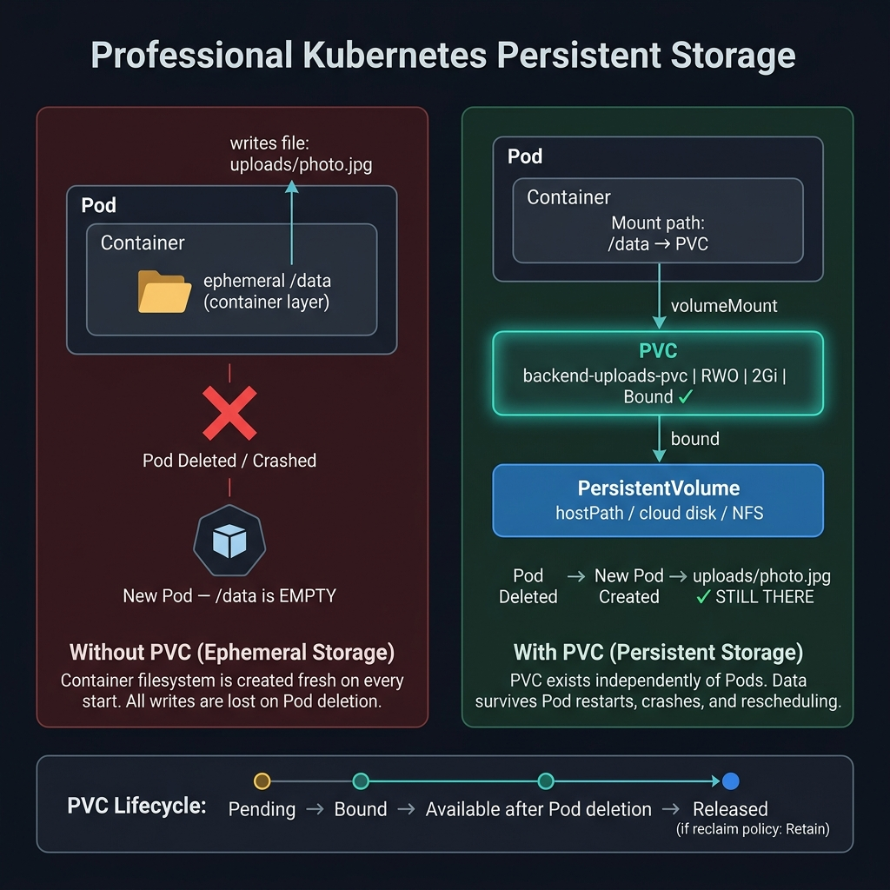

```
WITHOUT PVC:  writes → container layer → Pod deleted → data GONE

WITH PVC:
  [Pod: stateful-demo]
    | volumeMount: /data
    ↓
  [PVC: backend-uploads-pvc]  STATUS: Bound
    | bound to
    ↓
  [PV: actual disk]  ← data lives here, outside Pod lifecycle

  Pod deleted → PVC still Bound → PV untouched → data intact
  New Pod → same PVC → same PV → /data/uploads/demo.txt STILL THERE
```

#### 💡 Reflection: Storage as a First-Class Citizen

Running a Pod without persistent storage is running stateless compute. That's appropriate for web servers and API handlers. But any application that writes data that must outlive the process — a database, an upload service, a cache with persistence enabled — requires a PVC. Without it, Pod restarts silently destroy user data. With it, the Pod is as replaceable as any stateless workload while the data remains safe.

> For the full PVC lifecycle analysis, access mode guide, StorageClass explanation, and the file upload scenario walkthrough, see [Kubernetes Persistent Storage](docs/Kubernetes-Persistent-Storage.md).

### Phase 17: Ingress — External Traffic Routing ✅ *(NEW)*
We defined the AeroStore Ingress resource that routes all external HTTPS traffic through a single entry point into the correct internal Service, replacing per-service NodePort exposure with path-based routing through an Ingress Controller.

**What this phase covers:**
- Why **ClusterIP Services are internal-only** and how external traffic must enter through an Ingress Controller or NodePort/LoadBalancer.
- Why **NodePort does not scale** for production: non-standard ports, no TLS, no path routing, no centralized rate limiting, firewall complexity.
- The **complete traffic path**: Client → DNS → Cloud LB → Ingress Controller Pod → Ingress rules match host+path → ClusterIP Service → kube-proxy → Pod.
- The distinction between an **Ingress resource** (routing rules YAML) and an **Ingress Controller** (the running proxy Pod that enforces them) — both are required.
- **Path-based routing**: `/api/*` routes to `aerostore-backend-service:3001`, `/*` routes to `aerostore-frontend-service:80` — from one hostname, one IP, one port 443.
- **TLS termination** at the Ingress Controller: decrypts HTTPS once for all services, forwards plain HTTP internally.
- nginx annotations for URL **rewriting** (strip `/api` prefix), **SSL redirect**, and **rate limiting**.

**Key principle:** *Ingress is the single front door to the cluster. All external traffic enters on port 443, is decrypted once, and is routed to the correct Service by path or host. Adding a new service is three lines of YAML — no new load balancer, no new port, no new firewall rule.*

- *Docs:* [Kubernetes Ingress & Traffic Routing](docs/Kubernetes-Ingress-And-Traffic-Routing.md).
- *Manifest:* [`k8s/basics/aerostore-ingress.yaml`](k8s/basics/aerostore-ingress.yaml).

#### 📊 Ingress Traffic Flow Diagram

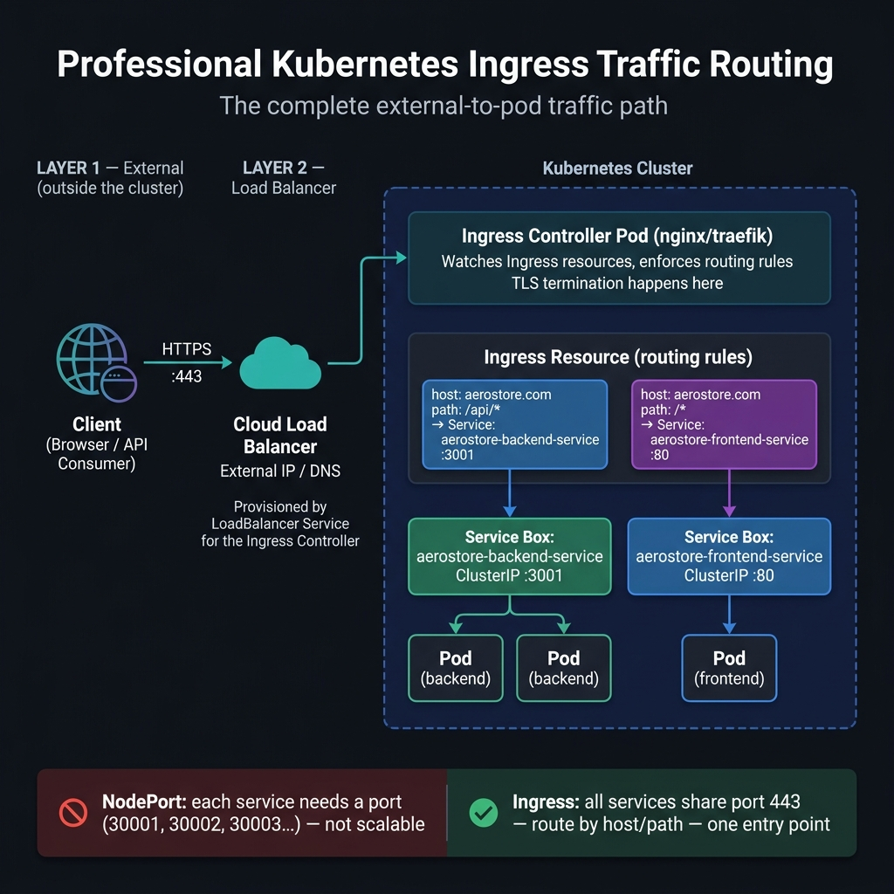

```
Client → HTTPS :443 → DNS → Cloud LB → Ingress Controller
                                                  │
                                    reads Ingress routing rules
                                                  │
                  /api/* → aerostore-backend-service:3001 → [Pod] [Pod]
                  /*     → aerostore-frontend-service:80  → [Pod]

NodePort: 5 services = 5 ports (31001–31005) = 5 firewall rules
Ingress:  5 services = port 443 + 5 path rules = 1 firewall rule
```

#### 💡 Reflection: Ingress as the Cluster's Front Door

Ingress consolidates all external routing decisions into a single, auditable, version-controlled resource. Every routing rule is visible in one YAML file. TLS is handled once. Rate limits are applied at the edge, before requests reach application code. This is the architectural pattern that allows a cluster running dozens of services to present a single clean hostname to users, with routing that can be changed by merging a pull request.

> For the full traffic path analysis, Controller vs Resource distinction, path/host routing options, TLS setup, and the NodePort scenario, see [Kubernetes Ingress & Traffic Routing](docs/Kubernetes-Ingress-And-Traffic-Routing.md).

### Phase 18: NGINX Ingress Controller — Practical External Access ✅ *(NEW)*
We implemented a working local Ingress setup using the nginx Ingress Controller, enabling the AeroStore application to be accessed at `http://localhost` from outside the kind cluster. This phase bridges the architectural explanation of Phase 17 with a fully functional, runnable configuration.

**What this phase adds:**
- **`k8s/basics/nginx-ingress-local.yaml`** — HTTP Ingress for kind (no TLS, no host restriction) that routes `http://localhost/api/*` to the backend and `http://localhost/` to the frontend. Designed to work immediately after running the setup script.
- **`scripts/setup-ingress-controller.sh`** — automated setup: installs the nginx Ingress Controller, waits for it to be healthy, applies the Ingress resource, and prints the access URLs and debug commands.
- **`k8s/kind-cluster-config.yaml`** — updated with `extraPortMappings` (host:80 → container:80, host:443 → container:443) and `ingress-ready=true` node label — required for the controller to bind to localhost.
- **`docs/Kubernetes-Nginx-Ingress-Controller.md`** — step-by-step request walkthrough (OS routing → controller → rule match → URL rewrite → ClusterIP proxy → kube-proxy → Pod), how the controller auto-generates `nginx.conf`, and the ClusterIP scenario analysis.

**Access URLs (after setup script):**
```
http://localhost/           → React frontend SPA
http://localhost/api/       → Node.js backend API
http://localhost/api/products → GET /products (after /api rewrite)
```

**Key principle:** *The nginx Ingress Controller is the bridge between the external network and the internal cluster network. ClusterIP Services are unreachable externally by design. The controller Pod binds to host port 80, receives external traffic, and proxies it to ClusterIP Services using the cluster's internal DNS — services that would otherwise be invisible to outside users.*

- *Docs:* [NGINX Ingress Controller](docs/Kubernetes-Nginx-Ingress-Controller.md).
- *Manifest:* [`k8s/basics/nginx-ingress-local.yaml`](k8s/basics/nginx-ingress-local.yaml).
- *Setup script:* [`scripts/setup-ingress-controller.sh`](scripts/setup-ingress-controller.sh).

### Phase 19: RBAC — Role-Based Access Control ✅ *(NEW)*
We implemented Kubernetes RBAC for the AeroStore cluster, defining two namespace-scoped Roles and binding them to dedicated ServiceAccounts — a read-only `dev-viewer` for developers and a deploy-only `cicd-deployer` for CI/CD pipelines, all within the `dev-team` namespace.

**What this phase covers:**
- The **default-deny** model: all Kubernetes API requests are denied unless explicitly permitted by a Role + RoleBinding.
- **`Role` (not ClusterRole)** for namespace isolation — a Role in `dev-team` has zero effect in `production` or `staging`, even with the same ServiceAccount credentials.
- **`dev-viewer` Role** — `get/list/watch` on pods, pod logs, services, deployments, configmaps, and events. Explicitly excludes: secrets, exec, all write verbs.
- **`cicd-deployer` Role** — `get/list/watch` on deployments + `update/patch` on deployments only. Cannot delete, create, or access Secrets.
- **`RoleBindings`** — the binding itself is namespace-scoped and immutable in its `roleRef`.
- **`kubectl auth can-i`** verification: proves allowed and denied actions without executing real requests.

**Allowed vs Denied:**

| Action | Developer SA | CI/CD SA |
|---|---|---|
| `kubectl get pods` | ✅ | ✅ |
| `kubectl logs pod` | ✅ | ❌ |
| `kubectl delete pod` | ❌ | ❌ |
| `kubectl get secrets` | ❌ | ❌ |
| Update Deployment image | ❌ | ✅ |
| Access `production` namespace | ❌ | ❌ |

- *Docs:* [Kubernetes RBAC](docs/Kubernetes-RBAC.md).
- *Manifests:* [`k8s/rbac/`](k8s/rbac/).

#### 📊 RBAC Diagram

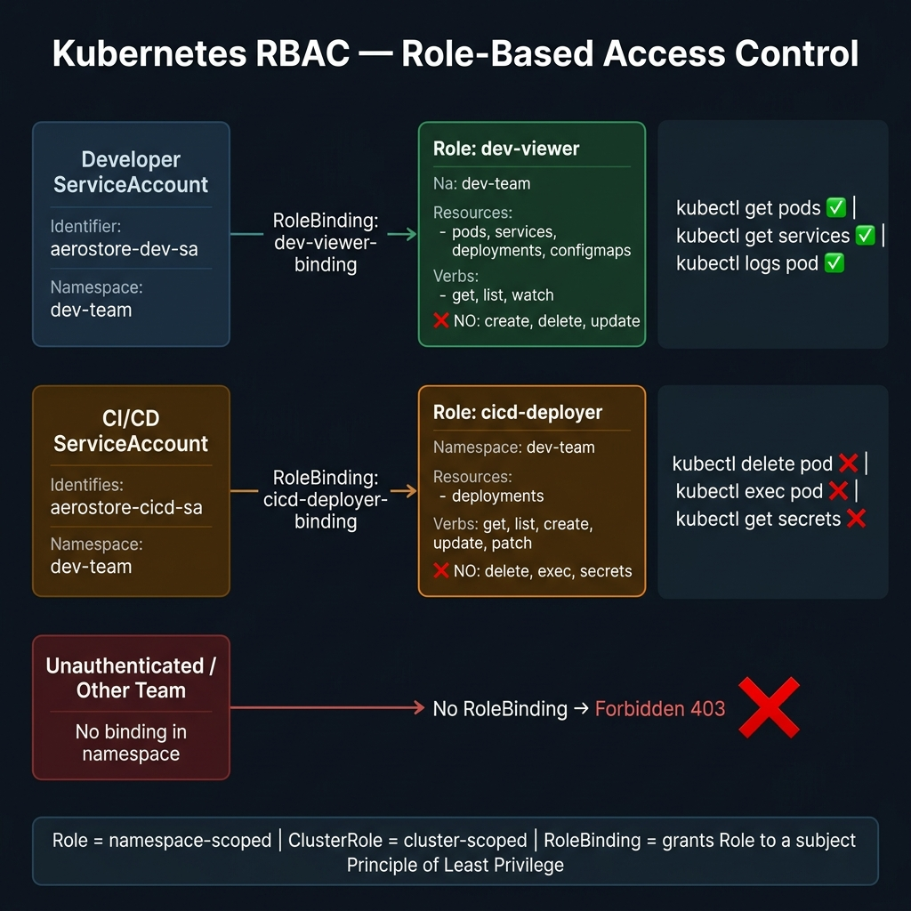

```
aerostore-dev-sa  → RoleBinding: dev-viewer-binding  → Role: dev-viewer
                    verbs: get, list, watch | NO delete, exec, secrets
aerostore-cicd-sa → RoleBinding: cicd-deployer-binding → Role: cicd-deployer
                    verbs: get, list, update, patch | NO delete, secrets
Other team SA     → No binding in dev-team → 403 Forbidden on all requests

Both Roles: namespace=dev-team ONLY → 403 in production/staging
```

> For the API server evaluation model, field-by-field Role explanation, and the multi-team scenario, see [Kubernetes RBAC](docs/Kubernetes-RBAC.md).

---


## 💻 Developer Guide: Running the K8s Environment

If you want to spin up the entire AeroStore Kubernetes environment locally, follow these steps:

### 1. Spin up the Cluster
We have a helper script to easily create the `kind` cluster:
```bash
./scripts/manage-k8s-cluster.sh start
```

### 2. Apply the Workloads & Networking
Deploy the application manifests and all Services:
```bash
# Option A: Raw kubectl (individual manifests)
# Apply ConfigMap and Secret first (Pods depend on them)
kubectl apply -f k8s/basics/app-configmap.yaml
kubectl apply -f k8s/basics/app-secret.yaml

# Apply namespace resource policy (LimitRange + ResourceQuota)
kubectl apply -f k8s/basics/namespace-resource-policy.yaml

# Apply Deployments, Services, and HPA
kubectl apply -f k8s/basics/nginx-deployment.yaml
kubectl apply -f k8s/basics/nginx-service.yaml
kubectl apply -f k8s/basics/backend-deployment.yaml
kubectl apply -f k8s/basics/backend-service.yaml
kubectl apply -f k8s/basics/backend-hpa.yaml

# Option B: Helm (recommended — single command, versioned release)
helm install aerostore-dev ./helm/aerostore \
  --values helm/aerostore/values-dev.yaml

# Or for production:
helm install aerostore-prod ./helm/aerostore \
  --values helm/aerostore/values-prod.yaml
```

### 3. Expose to Localhost
Because we are running a virtualized node inside Docker for Windows, we use port-forwarding to bridge the final gap to your browser:
```bash
kubectl port-forward service/aerostore-frontend-service 8080:80
```
*Open your browser to `http://localhost:8080` to see the application!*

---

## 📂 Repository Structure

```text
├── backend/          # Express API source code
├── frontend/         # React SPA source code
├── helm/             # Helm chart for the AeroStore application
│   └── aerostore/                           (v0.2.0)
│       ├── .helmignore                      ← NEW: chart packaging exclusions
│       ├── Chart.yaml                       (chart metadata)
│       ├── values.yaml                      (default values)
│       ├── values-dev.yaml                  (dev: 1 replica, no HPA, debug logs)
│       ├── values-staging.yaml              (staging: 2 replicas, HPA, info logs)
│       ├── values-prod.yaml                 (prod: 5 replicas, HPA max 12, warn)
│       ├── values.schema.json               (values validation schema)
│       ├── environments.md                  ← NEW: environment comparison runbook
│       ├── helm-demo.md                     (demo commands)
│       └── templates/
│           ├── NOTES.txt                    (post-install guide)
│           ├── _helpers.tpl                 (named templates)
│           ├── deployment.yaml
│           ├── service.yaml
│           ├── hpa.yaml                     (conditional on autoscaling.enabled)
│           └── configmap.yaml
├── k8s/
│   ├── kind-cluster-config.yaml
│   ├── rbac/                            ← NEW: RBAC manifests
│   │   ├── dev-team-namespace.yaml      (dedicated namespace for RBAC scope)
│   │   ├── serviceaccounts.yaml         (dev-sa and cicd-sa)
│   │   ├── dev-viewer-role.yaml         (read-only: get/list/watch)
│   │   ├── cicd-deployer-role.yaml      (deploy-only: update/patch deployments)
│   │   ├── role-bindings.yaml           (dev-sa→dev-viewer, cicd-sa→cicd-deployer)
│   │   └── rbac-demo.md                 (kubectl auth can-i verification commands)
│   └── basics/
│       ├── nginx-ingress-local.yaml
│       ├── aerostore-ingress.yaml       (production HTTPS Ingress with TLS)
│       ├── backend-pvc.yaml
│       ├── stateful-demo-pod.yaml
│       ├── persistence-demo.md
│       ├── rollout-demo.md
│       ├── backend-hpa.yaml
│       ├── scaling-demo.md
│       ├── resource-demo-pod.yaml
│       ├── namespace-resource-policy.yaml
│       ├── probe-demo-pod.yaml
│       ├── app-configmap.yaml
│       ├── app-secret.yaml
│       ├── backend-deployment.yaml
│       ├── backend-service.yaml
│       ├── curl-client-pod.yaml
│       ├── nginx-deployment.yaml
│       ├── nginx-service.yaml
│       ├── nginx-pod.yaml
│       └── nginx-replicaset.yaml
├── scripts/          # Automation scripts
│   ├── setup-ingress-controller.sh  ← NEW: install nginx controller + apply Ingress
│   └── manage-k8s-cluster.sh
├── docs/             # Extensive documentation on DevOps concepts
│   ├── Kubernetes-RBAC.md                            ← NEW: RBAC docs
│   ├── k8s-rbac-diagram.png                          ← NEW: RBAC diagram
│   ├── Kubernetes-Nginx-Ingress-Controller.md
│   ├── Kubernetes-Ingress-And-Traffic-Routing.md
│   ├── k8s-ingress-diagram.png
│   ├── Kubernetes-Persistent-Storage.md
│   ├── k8s-persistent-storage-diagram.png
│   ├── Helm-Environment-Configuration.md
│   ├── Kubernetes-Helm-Package-Management.md
│   ├── k8s-helm-diagram.png
│   ├── Kubernetes-Rolling-Updates-And-Rollbacks.md
│   ├── k8s-rolling-update-diagram.png
│   ├── Kubernetes-Scaling-And-HPA.md
│   ├── k8s-scaling-hpa-diagram.png
│   ├── Kubernetes-Resource-Management.md
│   ├── k8s-resource-management-diagram.png
│   ├── Kubernetes-Health-Probes.md
│   ├── k8s-health-probes-diagram.png
│   ├── Kubernetes-ConfigMaps-And-Secrets.md
│   ├── k8s-configmap-secret-diagram.png
│   ├── Kubernetes-Service-Discovery-And-Networking.md
│   ├── k8s-service-discovery-diagram.png
│   ├── CICD-Execution-Model-And-Responsibilities.md
│   ├── cicd-execution-diagram.png
│   ├── Kubernetes-Workload-Lifecycle.md
│   ├── k8s-lifecycle-diagram.png
│   ├── Artifact-Flow-Source-To-Cluster.md
│   ├── artifact-flow-diagram.png
│   ├── CICD-Pipeline-Plan.md
│   ├── Container-Registry-Tagging-And-Distribution.md
│   ├── Docker-Architecture-Images-Layers-Containers.md
│   ├── Kubernetes-Cluster-Architecture.md
│   └── ...more concept docs
└── README.md
```
