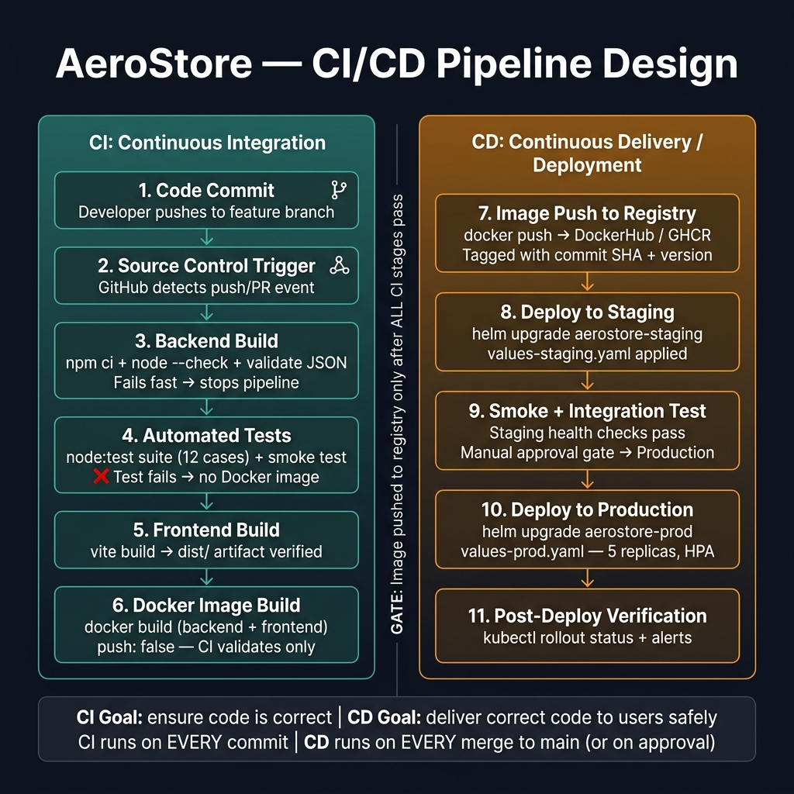

# CI/CD Pipeline Design — AeroStore

> This document defines the complete CI/CD pipeline for the AeroStore project, explicitly separating Continuous Integration (CI) stages from Continuous Delivery/Deployment (CD) stages, explaining the ordering rationale, and mapping each stage to the actual project workflow.

---

## Pipeline Overview Diagram



---

## The Core Distinction: CI vs CD

| | Continuous Integration (CI) | Continuous Delivery/Deployment (CD) |
|---|---|---|
| **Question answered** | "Is the code correct?" | "Can we safely deliver it to users?" |
| **Triggered by** | Every push / every PR | Merge to main (or manual approval) |
| **Runs on** | Feature branches | main branch artifacts |
| **Produces** | Pass/fail signal + Docker image | Running application in an environment |
| **Goal** | Catch defects early, fast | Deliver verified code reliably |
| **Failure means** | Fix before merging | Rollback, not "push harder" |

**CI is about developers.** It gives individuals fast feedback on their own changes.
**CD is about users.** It moves verified changes toward production safely.

---

## Full Pipeline Stages

### CONTINUOUS INTEGRATION STAGES

---

#### Stage 1 — Code Commit
**What:** A developer pushes commits to a feature branch.
**Why first:** Everything starts with a code change. The branch model (feature → PR → main) ensures that unreviewed changes never directly touch the main branch.
**Project mapping:** Any branch in `kalviumcommunity/S47-04-2026-ADH-DevOpsKubernetes`

---

#### Stage 2 — Source Control Trigger
**What:** GitHub detects the push event and starts the Actions workflow automatically.
**Why:** Manual trigger is error-prone — developers forget, skip it when in a hurry, or run different versions of checks locally. Automatic triggers make CI non-optional.
**Project mapping:** `.github/workflows/ci.yml` trigger:
```yaml
on:
  push:
    branches: ["**"]
  pull_request:
    branches: [main]
```

---

#### Stage 3 — Backend Build
**What:** Install dependencies (`npm ci`), check syntax (`node --check`), validate `products.json`.
**Why here:** Build is the prerequisite for everything else. If the code can't be installed or parsed, there's nothing to test. Running build first means test time isn't wasted on broken code.
**Failure behavior:** Pipeline stops here. Tests and Docker build are skipped. Developer is notified immediately.
**Project mapping:** `backend-build` job in `ci.yml`

---

#### Stage 4 — Automated Tests
**What:** Run the full test suite (`npm test` → `node:test` runner, 12 test cases across 3 suites). Then smoke test: start the HTTP server and confirm it responds on `/api/health`.
**Why here:** Tests run after build (code is known-parseable) but before Docker image creation (proven working → safe to containerize).
**What tests validate:**
- `products.json` data integrity (required fields, unique IDs, valid prices)
- Module loading (express, cors, JSON loadable without errors)
- Business logic (product count range, category presence, price sanity)
- HTTP runtime (server binds to port, /api/health returns 200)

**Failure behavior:** `docker-build` job is skipped via `needs: backend-test`. Broken code cannot become a container image.
**Project mapping:** `backend-test` job in `ci.yml`

---

#### Stage 5 — Frontend Build
**What:** `npm ci` then `npm run build` (Vite). Verifies `dist/index.html` exists.
**Why:** Frontend build runs in parallel with backend stages. If the React app has a broken import, a missing component, or a JSX syntax error, the build fails here — before any deployment is attempted.
**Failure behavior:** `docker-build` is skipped. No deployable frontend artifact exists.
**Project mapping:** `frontend-build` job in `ci.yml`

---

#### Stage 6 — Docker Image Build (CI Validation)
**What:** `docker build` both the backend and frontend Dockerfiles. `push: false` — images are built but not pushed to any registry.
**Why:** The Dockerfile is infrastructure code too. A broken Dockerfile (bad base image, wrong COPY path, failing RUN command) would cause a deployment failure. Validating it in CI catches these issues before any image reaches a registry.
**Why not push here:** CI's job is validation, not distribution. Pushing to a registry is a CD responsibility — it happens only on code that was merged to main, not on every feature branch.
**Project mapping:** `docker-build` job in `ci.yml` with `needs: [backend-test, frontend-build]`

---

### THE GATE

```
CI passes (all 4 jobs green on main) → merge is unblocked → CD pipeline starts
```

This gate is enforced by GitHub branch protection rules. The merge button is disabled until all required CI checks pass. Code that hasn't passed CI cannot enter the CD pipeline.

---

### CONTINUOUS DEPLOYMENT STAGES

---

#### Stage 7 — Image Push to Registry
**What:** After CI passes on main, the CD pipeline builds and pushes Docker images to a container registry (GitHub Container Registry / DockerHub).
**Why here:** Images are only pushed from verified, merged code — never from feature branches. The image tag includes the commit SHA so every image is traceable to an exact commit.
**Project mapping:** CD workflow (`.github/workflows/cd.yml`) triggered on push to main:
```yaml
docker tag aerostore-backend:${{ github.sha }}
docker push ghcr.io/org/aerostore-backend:${{ github.sha }}
docker push ghcr.io/org/aerostore-backend:latest
```

---

#### Stage 8 — Deploy to Staging
**What:** Helm upgrade using `values-staging.yaml` — 2 replicas, HPA enabled (max 5), info logging, the new image tag.
**Why staging before production:** Staging is the last validation environment before real users are affected. It runs the same image and same configuration (with scaled-down resources) to catch environment-specific issues.
**Project mapping:**
```bash
helm upgrade aerostore-staging ./helm/aerostore \
  --values helm/aerostore/values-staging.yaml \
  --set image.tag=${{ github.sha }} \
  --namespace staging
kubectl rollout status deployment/aerostore-staging -n staging
```

---

#### Stage 9 — Staging Smoke Test + Approval Gate
**What:** Automated health checks against the staging environment. If they pass, a manual approval is required before production deployment.
**Why manual approval:** Production affects real users. Even if staging passes, human judgment should confirm the release is appropriate. The approval gate is the point where a release can be held if there's a business reason (feature freeze, holiday traffic, pending communication).
**Project mapping:** GitHub Actions `environment: production` with required reviewers.

---

#### Stage 10 — Deploy to Production
**What:** Helm upgrade using `values-prod.yaml` — 5 replicas, HPA enabled (max 12), warn logging, strict resources.
**Why here:** Production deployment happens only after: CI passed, code was reviewed and merged, staging validated, manual approval given. Every gate before this point reduces the risk of this step.
**Project mapping:**
```bash
helm upgrade aerostore-prod ./helm/aerostore \
  --values helm/aerostore/values-prod.yaml \
  --set image.tag=${{ github.sha }} \
  --namespace production
```

---

#### Stage 11 — Post-Deploy Verification
**What:** `kubectl rollout status` confirms all Pods are Running. Health checks confirm the application is accepting traffic. Monitoring alerts are checked for spike in errors.
**Why:** A Helm upgrade can succeed (Kubernetes accepted the new spec) while Pods are still crash-looping. The rollout status check confirms the new version is actually running.
**Rollback:** If verification fails, `helm rollback aerostore-prod` reverts to the previous revision in seconds.

---

## Stage Ordering Rationale

```
Fast → Slow
Cheap → Expensive
Developer scope → User scope
```

The pipeline is ordered from fastest/cheapest to slowest/most impactful:
- Syntax check (milliseconds) catches issues before running tests (seconds)
- Tests (seconds) catch issues before Docker build (minutes)
- Docker build validates before pushing (bandwidth + registry cost)
- Staging deployment catches issues before production (user impact)

If a stage fails, all subsequent stages are skipped. The developer gets feedback at the earliest possible point.

---

## Risk Reduction at Each Stage

| Stage | Risk eliminated |
|---|---|
| Build (`npm ci`) | Dependency drift between developer machines |
| Syntax check | Parse errors that crash the server on startup |
| Tests | Data integrity bugs, logic regressions, import failures |
| Smoke test | Runtime crashes not caught by static analysis |
| Docker build | Broken Dockerfiles discovered before deployment |
| Registry push (main only) | Broken images in shared registry |
| Staging deploy | Environment-specific failures before production |
| Approval gate | Unintended releases during sensitive periods |
| Production deploy | Rolling update — zero-downtime change |
| Post-deploy verification | Silent rollout failures (crash-looping Pods) |

---

## Scenario: Manual Tests and Deployments

**Scenario:** Team currently runs tests and deployments manually. Process is slow, error-prone, and results in broken releases.

### Problems with Manual Process

1. **Skipping:** Developers forget to run tests when in a hurry. "I'll run them after the PR" — then forget.
2. **Environment differences:** Tests pass locally (Node 18) but fail in production (Node 20). No CI = no consistent environment.
3. **No gate:** Even if one developer remembers to test, nothing prevents another developer from merging without testing.
4. **Slow feedback:** Manual test runs happen at PR time, not at commit time. An hour of work may be based on broken code.
5. **Manual deployment:** Steps are missed, environment variables are wrong, the wrong image tag is deployed.

### How CI/CD Fixes This

| Manual problem | CI/CD solution |
|---|---|
| Forgotten tests | Tests run automatically on every push — cannot be skipped |
| Environment differences | CI runs in a clean, identical container on every run |
| No merge gate | Branch protection: merge button disabled until CI is green |
| Slow feedback | CI result in ~3 minutes of pushing, not at PR review time |
| Wrong image deployed | CD pipeline uses the exact commit SHA from the verified CI run |

### Why Separating CI and CD Improves Reliability

**CI** is optimized for speed and developer feedback. It runs on every commit, in seconds to minutes, and gives a pass/fail signal that the developer can act on immediately. If CI takes 20 minutes, developers stop waiting for it and start ignoring it.

**CD** is optimized for safety and control. It runs on merged, CI-verified code, deploys through multiple environments, includes human approval for production, and has rollback as a first-class operation. Mixing CI and CD concerns (deploying to production from every feature branch push) removes the deliberate checkpoints that prevent accidents.

Separating them means:
- CI can be aggressive — run on every commit, fail fast, be strict
- CD can be careful — deploy only verified artifacts, require approval, have rollback
- Neither compromises the other's design constraints
