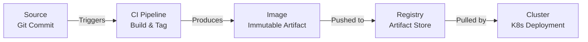

# End-to-End Artifact Flow in Modern DevOps

This document outlines the journey of a code change from a Git commit to a running container inside a Kubernetes cluster.

## The Artifact Journey Flow Diagram

---

## 1. What triggers the CI pipeline?
The Continuous Integration (CI) pipeline is triggered by events in the source code repository. The most common triggers are:
- A developer pushing a commit to a specific branch (like `main`).
- A developer opening, updating, or merging a Pull Request (PR).

## 2. How a Git commit becomes a Docker image
When the CI pipeline is triggered, it uses the specific Git commit hash as its input. The pipeline checks out the source code for that exact commit, runs automated tests, and if successful, builds a Docker image. 
This Docker image is a sealed package containing the application code, the runtime, all dependencies, and configuration defaults. Once built, this image is **immutable**—it never changes.

## 3. What image tags and digests represent
- **Image Tags**: These are human-readable labels assigned to a specific version of an image (e.g., `app:v1.3.2`, `app:latest`, or `app:commit-9f3a1c2`). They make it easy for engineers to identify the contents.
- **Image Digests**: These are cryptographic identifiers (SHA-256 hashes) representing the exact, immutable contents of the image. While tags can theoretically be reassigned, a digest guarantees you are deploying the exact same artifact every single time.

## 4. Why registries are critical
A Container Registry (like Docker Hub, GitHub Container Registry, or AWS ECR) acts as a centralized artifact store. Registries are critical because:
- They provide versioned, secure storage for built images.
- They enable traceability, allowing teams to map a running image directly back to the Git commit that produced it.
- Kubernetes pulls images exclusively from registries, never directly from source code.

## 5. How Kubernetes knows what to deploy
Kubernetes determines what to deploy through a declarative configuration file, known as a `Deployment` manifest. This file specifies:
- The exact **Image name and tag** (or digest) to pull from the registry.
- The desired number of **replicas** (how many instances of the container should run).
Kubernetes then continuously works to maintain this desired state, pulling the image, starting the containers, and monitoring their health.

## 6. How rollbacks work using images
Because every Docker image is an immutable snapshot, rollbacks are safe and predictable. If a new deployment fails or introduces a critical bug:
1. Engineers identify the last stable image tag.
2. The Kubernetes Deployment is updated to point to that previous, stable tag.
3. Kubernetes automatically pulls the stable image, performs a rolling update to replace the failing containers, and restores the system.
There is no need to rebuild code or guess what the previous state was—the registry stores the history, and Kubernetes simply opens the older "sealed package."
