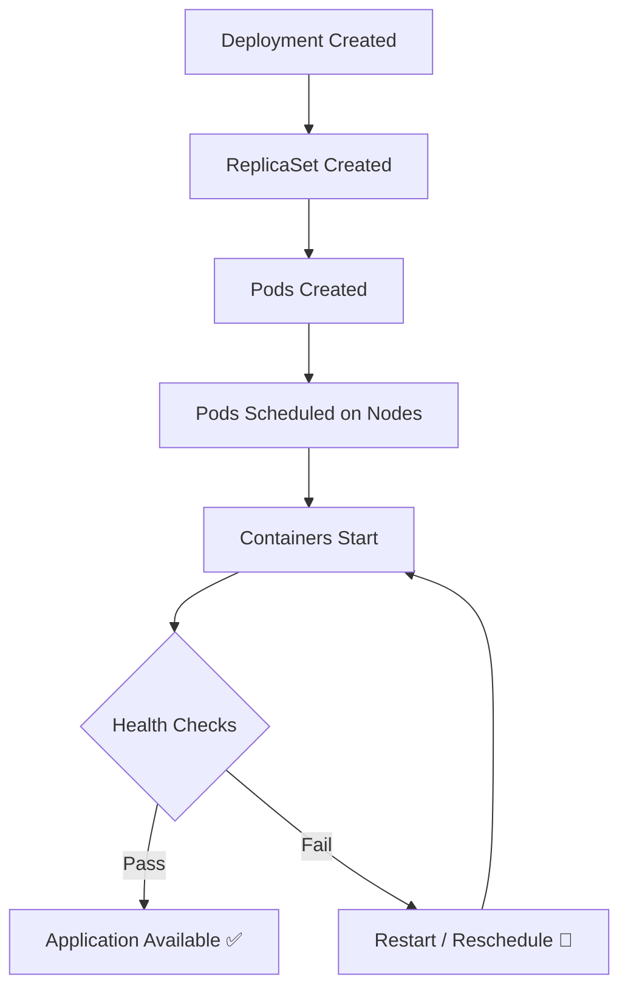

# Kubernetes Application Lifecycle Management

This document covers how Kubernetes manages the full lifecycle of an application — from creation, scheduling, and updates to failures and self-healing recovery.

## Lifecycle Flow Diagram

---

## 1. Pod Creation & Scheduling

A **Pod** is the smallest deployable unit in Kubernetes.

When you apply a Deployment manifest, the following chain happens:

1. Kubernetes creates a **ReplicaSet** from the Deployment spec.
2. The ReplicaSet creates the required number of **Pods**.
3. The **Scheduler** assigns each Pod to a suitable **Node** based on resource availability.
4. The **kubelet** on that Node pulls the container image and starts the container.

> **Key Insight**: You never create Pods directly in production — Deployments and ReplicaSets manage them for you.

---

## 2. ReplicaSets — Maintaining Desired State

A ReplicaSet ensures that the desired number of identical pods are always running.

For example, if `replicas: 3` is set:

| Event | ReplicaSet Response |
|---|---|
| A pod crashes | Creates a new pod to replace it |
| A node fails | Pods are recreated on other nodes |
| Replicas increased to 5 | 2 new pods are started |
| Replicas decreased to 2 | 1 pod is terminated |

> **Key Idea**: ReplicaSets are the **self-healing mechanism** behind Kubernetes Deployments.

---

## 3. Deployment Rollouts & Rolling Updates

When you update your application (e.g., push a new Docker image), Kubernetes performs a **rollout** using the **Rolling Update** strategy (default):

1. New pods are created with the **new image**.
2. Old pods are **terminated gradually**.
3. Traffic shifts incrementally to new pods.
4. **Availability is maintained** throughout the process.

### Possible Rollout Outcomes

| Outcome | Description |
|---|---|
| ✅ Successful | All new pods become ready |
| ⏸️ Paused | Waiting for manual intervention |
| ❌ Failed | New pods never become healthy |

Rollout state can be inspected via Deployment status, Pod readiness, and ReplicaSet history.

---

## 4. Health Probes — How Kubernetes Knows a Pod Is Healthy

Kubernetes uses **probes** to actively check pod health rather than guessing.

| Probe Type | Purpose | Failure Action |
|---|---|---|
| **Liveness Probe** | Is the container alive? | Container is **restarted** |
| **Readiness Probe** | Can the pod receive traffic? | Pod is **removed from Service load balancing** |
| **Startup Probe** | Is the app still starting up? | Prevents premature restarts for slow apps |

> **Key Insight**: Incorrect probe configuration is one of the most common causes of broken deployments.

---

## 5. Resource Limits & Scheduling Behavior

Each pod can define **CPU** and **Memory** requests and limits. These directly affect scheduling and runtime behavior:

| Scenario | Kubernetes Behavior |
|---|---|
| CPU limit exceeded | Pod is **throttled** (slowed down) |
| Memory limit exceeded | Pod is **OOMKilled** (terminated) |
| Resource requests too high | Pod stays **Pending** (cannot be scheduled) |

---

## 6. Common Pod States & What They Indicate

| Pod State | Meaning |
|---|---|
| `Pending` | Scheduler cannot find a suitable node |
| `Running` | Container is executing normally |
| `CrashLoopBackOff` | Application keeps crashing and restarting |
| `ImagePullBackOff` | Docker image cannot be pulled from the registry |
| `OOMKilled` | Container exceeded its memory limit |
| `Terminating` | Pod is in the process of shutting down |

Each state points to exactly where in the lifecycle the failure is occurring.

---

## 7. Failure Recovery & Self-Healing

Kubernetes automatically responds to failures to maintain the **desired state**:

- **Pod crashes** → Restarted by the kubelet
- **Node fails** → Pods rescheduled to healthy nodes
- **Health checks fail** → Traffic rerouted away from unhealthy pods
- **Replica count violated** → New pods created or excess pods terminated

> **Important**: Kubernetes guarantees **desired state**, not that your application logic is correct. It will keep restarting a buggy app forever.

---

## Key Takeaways

1. Always debug starting from **Pod status** — it tells you exactly what went wrong.
2. Think in terms of **desired state vs. current state** — Kubernetes constantly reconciles the two.
3. Probes, resource limits, and configs are **signals** Kubernetes relies on — misconfigure them and deployments break silently.
4. If you understand **why a pod is unhealthy**, you understand Kubernetes.
