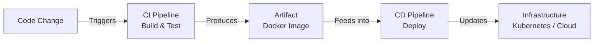

# CI/CD Pipeline Structure & Responsibility Boundaries

This document explains how CI/CD pipelines are structured, how execution flows through stages, and where responsibility boundaries lie between code, pipelines, and infrastructure.

## Pipeline Execution Flow

---

## 1. Continuous Integration (CI) — Responsibilities

CI focuses on **validating code changes**. It answers one question:

> **"Is this code safe to merge?"**

### What CI does:
- Checks out source code
- Runs unit tests
- Runs linting / static analysis
- Builds artifacts (e.g., Docker images)
- Tags the image (e.g., `app:commit-9f3a1c2`)
- Pushes the image to a container registry
- **Fails fast** if anything is broken

### CI is triggered by:
- Pull Requests
- Commits pushed to branches

---

## 2. Continuous Deployment (CD) — Responsibilities

CD focuses on **releasing validated artifacts**. It answers one question:

> **"How do we safely run this version in production?"**

### What CD does:
- Pulls a **pre-built** artifact (Docker image) from the registry
- Deploys it to the target environment
- Updates Kubernetes Deployment manifests
- Manages rollout and rollback strategies

> **Important**: CD does **not** rebuild code — it deploys artifacts already produced by CI.

---

## 3. Where Different Actions Belong

| Action | Happens In |
|---|---|
| Writing business logic | Application code |
| Unit tests | Application code |
| Running tests | CI pipeline |
| Building Docker image | CI pipeline |
| Tagging image | CI pipeline |
| Pushing image to registry | CI pipeline |
| Updating Kubernetes manifests | CD pipeline |
| Applying manifests to cluster | CD pipeline |
| Restarting failed Pods | Kubernetes |

> **Key Insight**: Pipelines **orchestrate** actions — they do not replace application logic or infrastructure behavior.

---

## 4. Responsibility Boundaries

Modern DevOps enforces strict separation:

### Code Responsibility
- Implements features and business logic
- Defines tests
- Should **not** directly deploy itself

### Pipeline Responsibility
- Validates code quality
- Builds and ships artifacts
- Automates repeatable steps

### Infrastructure Responsibility
- Runs workloads
- Enforces desired state
- Self-heals failures

### Why this separation exists:
- Prevents accidental deployments
- Enables safe PR reviews
- Reduces blast radius of mistakes
- Makes rollbacks predictable

---

## 5. Safe Pipeline Modifications

Not all pipeline changes are equal:

| What You Modify | What It Affects |
|---|---|
| Test steps | CI validation |
| Build steps | Produced artifacts |
| Deployment steps | **Live systems** |

Pipeline configuration should always be:
- ✅ Version-controlled
- ✅ Protected by review rules
- ✅ Restricted on production branches
- ✅ Minimal and intentional

---

## 6. Common Misconceptions

| Misconception | Reality |
|---|---|
| "CI deploys code" | CI **builds confidence** — it validates, not deploys |
| "CD recompiles the application" | CD **moves artifacts** — it uses pre-built images |
| "Pipelines replace Kubernetes logic" | Kubernetes **runs and heals** — pipelines just trigger updates |

---

## Key Takeaways

1. **CI builds confidence** — it answers "is this code safe?"
2. **CD moves artifacts** — it answers "how do we release this safely?"
3. **Kubernetes runs and heals** — it maintains desired state independently.
4. Responsibility separation enables safe PRs, predictable releases, and clean rollbacks.
